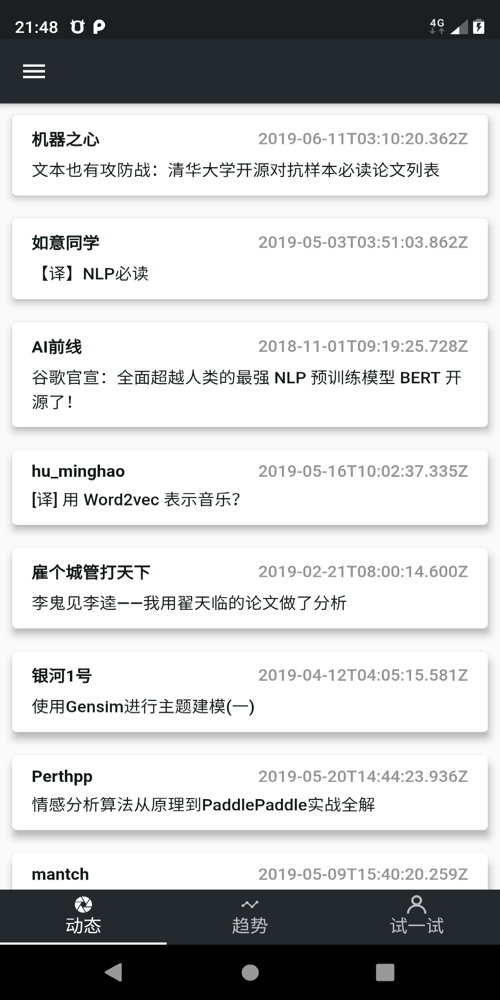
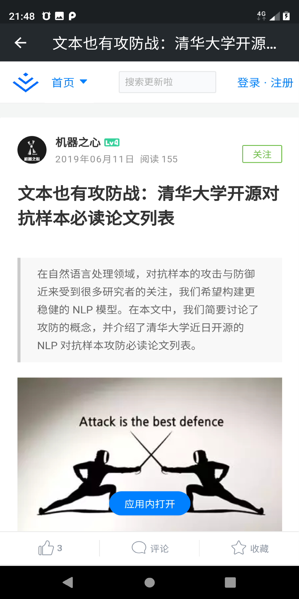
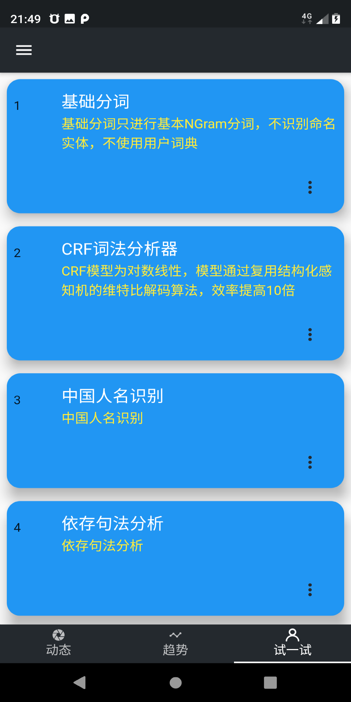
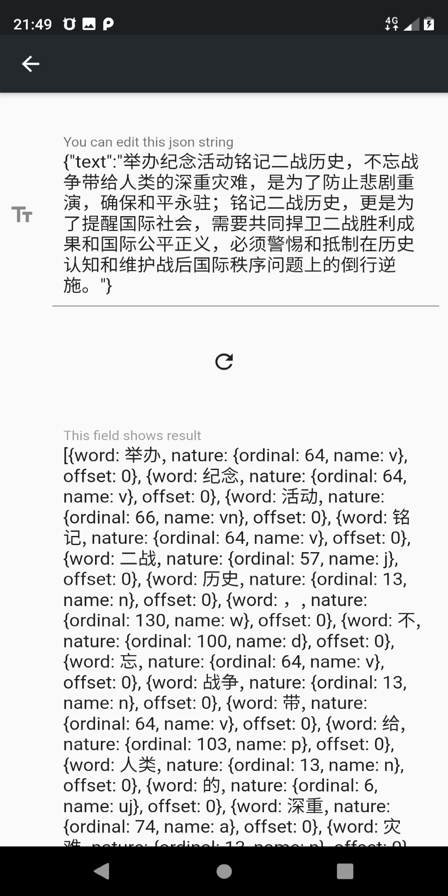

# NLPStarter

A NLP study app based on flutter.

## Getting Started

A NLP study app based on flutter. We provided a demo for flutter app development.<br/>
<br/>




<br/>

### Prerequisites

```
flutter
```

### Installing

```
git clone https://github.com/sppsun/acgnfuns-app.git
```

## Built With

* [Android Studio](https://developer.android.com/studio)

## Authors

* **sppsun** - *Initial work* - [sppsun](https://github.com/sppsun)

## License

This project is licensed under the MIT License - see the [LICENSE.md](LICENSE.md) file for details
